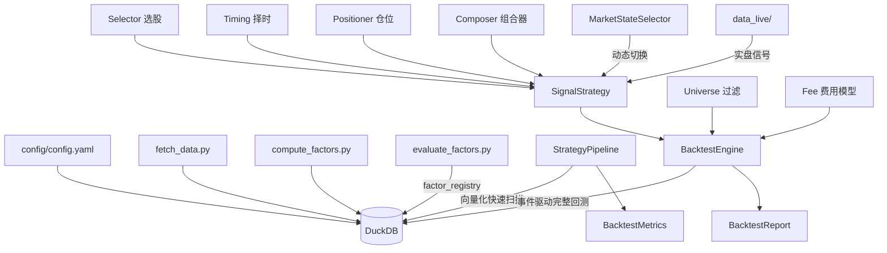

# zequant

A 股横截面 / 多因子量化研究框架。**DuckDB 单文件数据库 + 注册中心(选股/择时/仓位/策略) + 双评估路径(Pipeline 快速扫描 + BacktestEngine 完整回测) + 5 维综合评分排名 + MarketStateSelector 动态策略切换**，开箱即用。

## 核心特征

- 📦 **DuckDB 单文件数据库** —— 日线/因子/名册/评估/实盘全部在一个 `.db` 文件
- 🧮 **322 个因子** —— 101 个 WorldQuant Alpha + 191 个国泰君安 GTJA + 5 个 Fama-French + 13 个传统技术因子 + 筹码集中/超跌反弹因子
- 🧩 **27 个已注册策略** —— 动态切换 / 多因子 / 筹码集中 / 超跌反弹 / 组合 / 分层 / GA优化，详见 [`INDEX.md`](core/strategies/impl/INDEX.md)
- 🤖 **MarketStateSelector 动态策略切换** —— 根据市场状态(牛/熊/震荡/反弹)自动切换子策略组合，**综合分 79.4 全库第一**
- 📊 **5 维综合评分排名** —— 防御能力(25%) + 收益能力(20%) + 风险调整(20%) + 回撤控制(20%) + 恢复能力(15%)
- 🔗 **可插拔三段式** —— 选股 → 择时 → 仓位，每段都有抽象基类
- 🛡️ **完整 A 股交易摩擦建模** —— T+1、板块分级涨跌停、印花税/过户费/滑点、流动性过滤
- ⚖️ **真风险平价仓位** —— 基于协方差矩阵 CCD 迭代求解
- 🔍 **双评估路径** —— `StrategyPipeline`(快速向量化参数扫描) + `BacktestEngine`(事件驱动完整回测)
- 🌌 **Universe 过滤** —— ST/新股(≥60天)/板块分级涨跌停/停牌，排除不可交易股票
- 📡 **实盘信号** —— `data_live/<策略名>/build_<日期>.json`，支持 mss_dynamic / mf_d10_rp 等
- ✅ **31 个单元测试**

---

## 目录

- [最近优化](#最近优化)
- [项目结构](#项目结构)
- [部署](#一部署教程)
- [使用流程](#二使用操作指导)
- [策略概览](#三策略内容详解)
- [扩展开发](#四扩展开发)
- [架构图](#附架构图)

---

## 最近优化

| 优化项 | 说明 |
|---|---|
| **MarketStateSelector (2026-05-18)** | 新 `mss_dynamic` 动态策略切换，**综合分 79.4 全库第一**，9/9 窗口正收益，修复仅 9 天 |
| **5 轮深度优化** | 子策略替换/多策略组合/置信度加权/动量过滤/综合验证，确定 V6a_3way 为最优配置 |
| **实盘信号升级** | `live/signals/` 模块化，`mss_dynamic`/`generate`/`record` 统一入口 |
| **Pipeline 系统性修复 (2026-05-17)** | Universe 过滤(ST/新股/涨跌停/停牌) + 真实 tx_cost=0.002，排除了旧回测的高估偏差 |
| **5 维综合评分排名** | INDEX.md 排名表从"只看 Sharpe"改为"防御(25%)+收益+风险+回撤+恢复" |
| **MF 参数优化 (72 实验)** | 确认 `top_n=20, rebal_freq=10` 为 MF 系列最优参数 |
| **Fallback 数据源** | 默认 akshare，备用 baostock / efinance |
| **依赖精简** | 删除 backtrader/tushare/yfinance 等死依赖 |

详见 [`core/strategies/impl/INDEX.md`](core/strategies/impl/INDEX.md)

---

## 项目结构速览

```
core/
  database.py        DuckDB 数据库层
  config.py          配置加载
  datasource/        数据源(fetcher/fallback)
  strategies/        策略系统
    base/            SignalStrategy 抽象基类
    impl/            27 个已沉淀策略 + INDEX.md 排名
    selector.py      MarketStateSelector 动态策略切换
    pipeline.py      StrategyPipeline(向量化快速扫描)
  screening/         选股器(因子排名/多因子)
  timings/           择时器(趋势/波动率/市场状态)
  signals/           信号组合器(分层/直接/加权/投票)
  positioners/       仓位确定器(固定/趋势/波动率/风险平价)
  risk/              风险管理
  research/          研究工具(评估/归因)
  optimization/      优化器(GA/向量化评估)
factors/impl/        因子实现(alpha/gtja/fama_french/technical/chip/oscillators)
scripts/             命令行(拉数据/算因子/回测/评估)
live/                实盘系统
  config.yaml        实盘配置
  runner.py          统一调度器
  signals/           信号生成(mss_dynamic / generate / record)
  notification/      通知模块
  storage/           持仓快照
data_live/           实盘信号(<策略名>/build_<日期>.json)
daily/               每日研究目录
tests/               单元测试(31 个)
config/              主配置 config.yaml
```

---

## 一、部署教程

### 环境要求
- macOS / Linux, Python ≥ 3.9
- 磁盘: 日线 + 因子约 8~15 GB

### 安装

```bash
git clone <repo> zequant && cd zequant
python3 -m venv .venv && source .venv/bin/activate
pip install -r requirements.txt
```

### 初始化

```bash
python3 scripts/init_db.py                     # 建表
python3 scripts/fetch_data.py --full           # 拉全市场日线
python3 scripts/compute_factors.py --all       # 传统因子
python3 scripts/compute_alpha101_full.py       # 101 Alpha
python3 scripts/compute_gtja191.py --all       # 191 GTJA 因子
python3 scripts/compute_fama_french.py --all   # Fama-French
python3 scripts/evaluate_factors.py            # 评估因子
```

### 验证

```bash
python3 -m pytest tests/ -v    # 31 passed
```

---

## 二、使用操作指导

### 数据拉取

```bash
python3 scripts/fetch_data.py --full               # 全量
python3 scripts/fetch_data.py --incremental        # 增量
```

### 因子计算

```bash
python3 scripts/compute_factors.py --all           # 13个传统因子
python3 scripts/compute_alpha101_full.py           # 101 Alpha
python3 scripts/compute_gtja191.py --all           # 191 GTJA
python3 scripts/evaluate_factors.py                # 评估写 registry
```

### 跑策略

**双路径选择**:

1. **快速参数扫描**(推荐用于探索):
```python
from core.strategies.pipeline import StrategyPipeline
p = StrategyPipeline(name='quick_test', factor_names=[...],
    use_universe_filter=True, tx_cost=0.002)
result = p.run(start='2019-01-01', end='2026-04-30')
```

2. **完整策略回测**(使用真实 SignalStrategy):
```python
from core.strategies.impl import build_mf_d10_opt_0517
strategy = build_mf_d10_opt_0517(top_n=20)
# 然后用 BacktestEngine.run()...
```

### 查看策略排名

```bash
# 综合评分排名(5维加权)
cat core/strategies/impl/INDEX.md | head -80
```

### 生成实盘信号

```bash
# mss_dynamic 动态策略（全库第一 🏆）
python3 -m live.signals.mss_dynamic --capital 50000

# 旧策略
python3 -m live.signals.generate --strategy mf_d10_rp --capital 50000

# 录入实盘成交
python3 -m live.signals.record --trades "000001 B 100 10.52"
```

信号文件自动写入 `data_live/<策略名>/build_<日期>.json`。

---

## 三、策略内容详解

zequant 当前沉淀 **27 个已注册策略**，按信号类型分类:

### 🏆 动态切换策略(Dynamic) — 全库第一
| 策略 | 综合分 | 年化% | Sharpe | 回撤% | 修复天数 |
|:----|:-----:|:----:|:-----:|:----:|:-------:|
| **mss_dynamic** 🥇 | **79.4** | 24.75 | **1.421** | **-13.84** | **9** |

MarketStateSelector 根据市场状态（牛/熊/震荡/反弹）自动切换子策略组合，V6a_3way 配置。
**9/9 市场窗口全部正收益**，全区间(2019-01~2026-04)跑通含 OOS。

### 多因子策略(MultiFactor) — 主力
| 策略 | 综合分 | 年化% | Sharpe | 特点 |
|:----|:-----:|:----:|:-----:|:-----|
| **mf_d10_rp** 🥈 | **72.6** | 38.03 | 1.306 | 熊市防御满分 |
| **mf_vol_d10_opt** 🥉 | 71.7 | 26.13 | 1.277 | 调优最佳 |
| **mf_d10_opt_0517** ✨ | 60.6 | 32.84 | 1.208 | **修正Pipeline验证** |
| **mf_vol_d10_rp** | 70.6 | 26.13 | 1.334 | 熊牛市皆强 |

### 筹码集中策略(ChipConcentration) — 防御
| 策略 | 综合分 | 年化% | 回撤% |
|:----|:-----:|:----:|:----:|
| chip_covrp | 70.1 | 14.96 | -9.68 |
| chip_equal_d3 | 69.4 | 17.43 | -11.19 |

### 组合策略(Combo) — 均衡
| 策略 | 综合分 | 年化% | Sharpe |
|:----|:-----:|:----:|:-----:|
| mf60_chip40_combo | 70.7 | 24.84 | 1.269 |
| mf50_chip50_combo | 69.3 | 22.29 | 1.257 |

> **完整排名 + 所有 27 个策略的 5 维评分见** [`core/strategies/impl/INDEX.md`](core/strategies/impl/INDEX.md)

---

## 四、扩展开发

### 新因子

```python
# core/factors/custom/my_factor.py
from core.database import Database

def compute_factor(db: Database, start: str, end: str):
    # 计算逻辑
    pass
```

### 新策略

```python
# 参考 core/strategies/impl/mf_d10_opt_0517/ 的模板
from ...base.strategy import SignalStrategy
from ....screening import MultiFactorSelector
from ....signals import LayeredComposer, MaxSingleWeightConstraint

def build_my_strategy(top_n: int = 20, **kwargs) -> SignalStrategy:
    # 构建策略实例
    pass
```

注册到 `core/strategies/impl/__init__.py` 即可被系统识别。

---

## 附:架构图



---

## License

MIT
