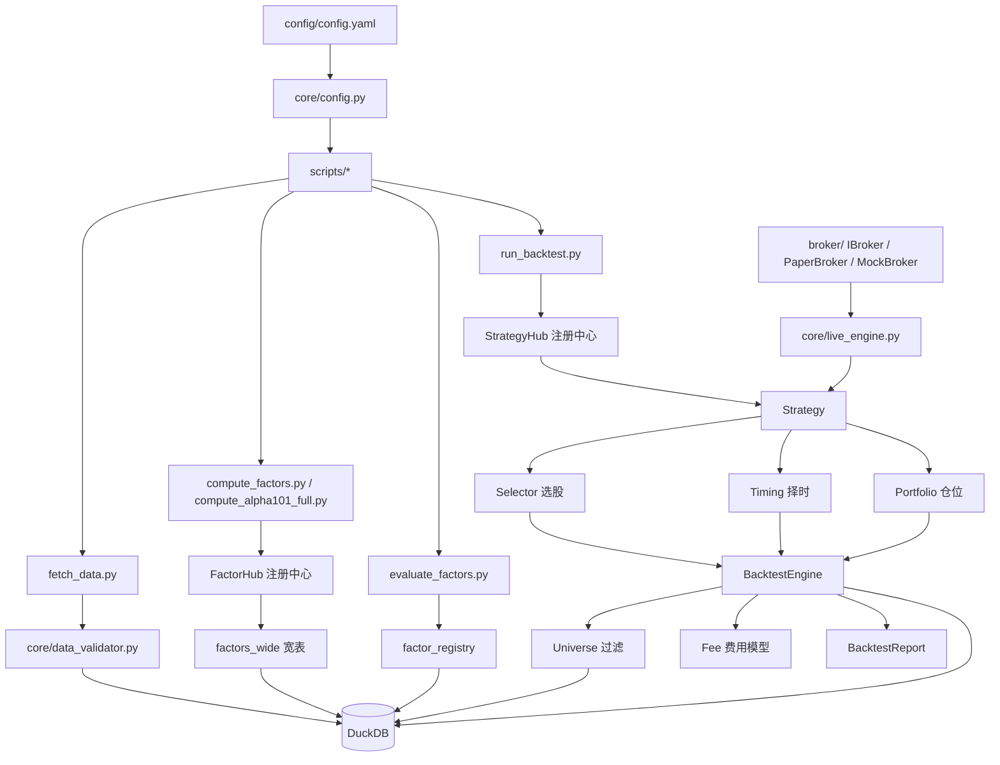

# zequant

A 股横截面 / 多因子量化研究框架。**单文件数据库 + 注册中心 + 三段式策略 + 评估驱动 walk-forward**,开箱即用。

核心特征:
- 📦 **单文件 DuckDB**(数据/因子/评估/注册表) —— 无外部依赖
- 🧮 **因子宽表 + [`FactorHub`](core/factor_hub.py:52) 注册中心** —— 101 个 WorldQuant Alpha(已按原论文修正 alpha1 公式) + 13 个传统因子,支持 `n_jobs` 并行计算
- 🧩 **[`StrategyHub`](core/strategy_hub.py:62) 统一策略入口** —— 静态策略 / 评估驱动策略 一条命令行拉起;FactorHub / StrategyHub 已改为实例级注册,杜绝测试污染并支持并行研究
- 🔗 **可插拔三段式** —— 选股 → 择时 → 仓位,每段都有抽象基类,随意替换;择时与选股严格使用目标日期前数据,回测成交于次日开盘价,彻底消除前视偏差
- ⚖️ **真风险平价仓位** —— [`RiskParityBuilder`](portfolios/risk_parity.py) 基于历史收益协方差矩阵,通过 Cyclical Coordinate Descent 求解真实风险平价权重(非简单逆波动率)
- 🛡️ **A 股交易摩擦完整建模** —— T+1、板块分级涨跌停、印花税/过户费/滑点、止损止盈、流动性过滤
- 🔍 **数据校验层** —— [`core/data_validator.py`](core/data_validator.py) 提供价格异常检测、缺失数据识别与质量指标,已嵌入数据拉取与因子计算流程
- 📡 **实盘/模拟交易接口** —— `broker/` 目录提供 [`IBroker`](broker/base.py) 抽象基类、[`PaperBroker`](broker/paper.py) 模拟撮合、[`MockBroker`](broker/mock.py) 测试替身,配合 [`LiveEngine`](core/live_engine.py) 支持实盘/纸交易
- ✅ **31 个单元测试 + 端到端冒烟** —— 重构改动都有守门

---

## 目录

- [一、部署教程](#一部署教程)
- [二、使用操作指导](#二使用操作指导)
- [三、策略内容详解(每个策略逐个讲)](#三策略内容详解每个策略逐个讲)
- [四、扩展开发(新因子 / 新策略 / 新择时器)](#四扩展开发)
- [附:架构图](#附架构图)

---

## 项目结构速览

```
core/        数据库、回测引擎、配置加载、注册中心、Universe、风控、因子评估、数据校验、实盘引擎
factors/     因子实现(@register_factor 注册到 FactorHub)
screening/   选股器(IStockSelector)
timings/     择时器(ITimingGenerator)
portfolios/  仓位分配器(IPortfolioBuilder)
strategies/  策略组装(@register_strategy 注册到 StrategyHub)
broker/      交易接口抽象(IBroker) + 模拟/测试实现
scripts/     拉数据 / 算因子 / 评估 / 回测 / 清库 命令行
tests/       单元测试(31 个)
config/      主配置 config.yaml(所有脚本都读它)
```

---

## 最近优化

以下改进已合入主线,显著提升了回测真实性、计算效率与可维护性:

| 优化项 | 说明 | 相关文件 |
|---|---|---|
| **Alpha1 公式修正** | 按 WorldQuant 原论文,`alpha001` 在 `ret >= 0` 分支使用 `std20`(20 日标准差),原错误实现为 `close`。 | [`factors/alpha101_full.py`](factors/alpha101_full.py) |
| **实例级注册中心** | `FactorHub` 与 `StrategyHub` 从类级单例改为实例级注册,彻底消除测试间状态污染,支持多进程并行研究。 | [`core/factor_hub.py`](core/factor_hub.py) / [`core/strategy_hub.py`](core/strategy_hub.py) |
| **消除前视偏差(信号)** | `TrendTiming`、`ComboTiming`、`FactorRankSelector`、`MultiFactorSelector` 统一改为严格使用目标日期**之前**的数据生成信号。 | `timings/*.py` / `screening/*.py` |
| **消除前视偏差(成交)** | `BacktestEngine` 订单执行价从"当日收盘价"改为**下一交易日开盘价**,杜绝"看到收盘再交易"的不可能行为。 | [`core/backtest.py`](core/backtest.py) |
| **真风险平价** | `RiskParityBuilder` 不再做简单逆波动率加权,而是计算历史收益协方差矩阵,用 Cyclical Coordinate Descent 迭代求解真实风险平价权重。 | [`portfolios/risk_parity.py`](portfolios/risk_parity.py) |
| **并行因子计算** | `FactorHub.compute_all()` 新增 `n_jobs` 参数,通过 `ProcessPoolExecutor` 多进程并行计算因子,大幅缩短 101 Alpha 计算时间。 | [`core/factor_hub.py`](core/factor_hub.py) |
| **数据校验层** | 新增 `core/data_validator.py`,提供价格异常(跳空、负值)、缺失数据检测与质量评分;已集成到 `fetch_data.py` 与 `compute_factors.py`。 | [`core/data_validator.py`](core/data_validator.py) |
| **实盘交易接口抽象** | 新增 `broker/` 目录:`IBroker` 抽象基类定义统一下单/查持仓/查资金接口;`PaperBroker` 用于模拟撮合;`MockBroker` 用于单元测试。配合 `core/live_engine.py` 可直接驱动实盘/纸交易。 | `broker/*.py` / [`core/live_engine.py`](core/live_engine.py) |

---

## 一、部署教程

### 1.1 环境要求

- **操作系统**:macOS / Linux(Windows 理论可用,未做自动化测试)
- **Python**:≥ 3.9(需要 `from __future__ import annotations` 行为)
- **磁盘**:DuckDB 全市场 + 101 Alpha 大约 **8~15 GB**(见 2.5 节缩库脚本)

### 1.2 克隆与依赖安装

```bash
git clone <your-repo-url> zequant
cd zequant

# 强烈建议虚拟环境(避免与系统 Python 污染)
python3 -m venv .venv
source .venv/bin/activate

pip install -r requirements.txt
```

依赖清单(见 [`requirements.txt`](requirements.txt)):

| 依赖 | 用途 |
|---|---|
| `duckdb` | 单文件列存数据库,所有数据载体 |
| `pandas` / `numpy` | 因子/回测计算 |
| `pyyaml` | 读 [`config/config.yaml`](config/config.yaml) |
| `akshare` | A 股日线/名册数据源(默认,免费) |
| `pytest` | 跑单元测试 |

### 1.3 初始化数据库

```bash
python3 scripts/init_db.py
```

执行后会在 [`data/quant_data.db`](data/quant_data.db) 创建下列表(已建好就会跳过):

| 表名 | 说明 | 主键 |
|---|---|---|
| `daily_bars` | 日线行情 | `(symbol, date)` |
| `factors_wide` | 因子宽表,每个因子一列(动态 ALTER 扩展) | `(date, symbol)` |
| `symbols` | 股票名册(含 `name`/`list_date`/板块) | `symbol` |
| `factor_registry` | 因子评估结果(IC/IR/换手等)+ enabled 开关 | `factor_name` |
| `update_log` | 增量更新审计日志 | - |

### 1.4 配置文件

所有脚本统一读 [`config/config.yaml`](config/config.yaml),没有任何"只在某个脚本里硬编码"的死配置。
加载逻辑集中在 [`core/config.py`](core/config.py:71) 的 [`load_config()`](core/config.py:71),
带 schema 内置默认值,yaml 缺字段时不会抛异常。

重点字段速查:

| 段 | 字段 | 用途 | 默认值 |
|---|---|---|---|
| `database.path` | - | DuckDB 文件路径 | `./data/quant_data.db` |
| `universe.exclude` | - | 排除规则(ST / 新股) | `ST股` + `上市不满60天` |
| `universe.min_daily_amount` | - | 最低成交额(元),低于视为流动性不足 | `100_000_000` |
| `fees.*` | - | 印花税/佣金/过户费/滑点 | A 股实盘标准(0.1% / 0.03% / 0.002% / 0.05%) |
| `risk.max_position_pct` | - | 单股最大仓位 | `0.15` |
| `risk.max_total_position` | - | 总仓位最大占比 | `0.85` |
| `risk.stop_loss` | - | 亏损止损线 | `0.10` |
| `risk.take_profit` | - | 盈利止盈线 | `0.25` |
| `backtest.initial_capital` | - | 初始资金 | `1_000_000` |
| `backtest.start_date` / `end_date` | - | 默认回测区间 | 2019-01-01 ~ 2026-05-01 |
| `factors.ir_threshold` | - | 因子启用阈值 | `0.05` |
| `factors.forward_days` | - | IC 前瞻窗口(交易日) | `5` |

修改配置不需要重启任何进程 —— 所有脚本每次调用都会重新加载 yaml。

### 1.5 验证部署

```bash
# 跑 31 个单元测试,应全部通过
python3 -m pytest tests/ -v

# 期望结果
# ========================== 31 passed in X.XXs ==========================
```

如果测试失败,多半是 `duckdb` / `pandas` 版本问题;参考 [`requirements.txt`](requirements.txt) 锁定版本后重装。

测试覆盖:
- [`tests/test_factor_hub.py`](tests/test_factor_hub.py) —— FactorHub 注册中心(4 个 case)
- [`tests/test_strategy_hub.py`](tests/test_strategy_hub.py) —— StrategyHub 注册中心(5 个 case)
- [`tests/test_selectors.py`](tests/test_selectors.py) —— FactorRank/MultiFactor 选股器(7 个 case)
- [`tests/test_backtest_smoke.py`](tests/test_backtest_smoke.py) —— 端到端回测冒烟(1 个 case)
- [`tests/test_universe.py`](tests/test_universe.py) / [`test_t1.py`](tests/test_t1.py) / [`test_fee.py`](tests/test_fee.py) —— 板块涨跌停 / T+1 / 费用模型

### 1.6 常见部署问题

| 症状 | 原因 | 处理 |
|---|---|---|
| `akshare` 连接超时 | 需要网络;akshare 内部可能走新浪财经 | 挂代理,或临时改 `data_source.primary=tushare` 并配置 token |
| 首次 `compute_alpha101_full` 很慢 | 101 列 ALTER TABLE 单独 fsync | 已优化为单事务批量 ALTER,< 200ms(见 [`ensure_factor_columns`](core/database.py:201))。若仍慢请检查 SSD 性能 |
| 磁盘占用无限增长 | DuckDB 不自动 VACUUM | 跑 [`scripts/vacuum_db.py`](scripts/vacuum_db.py) 做冷重建(EXPORT→IMPORT) |
| 另一个进程占用 db | IDE 的 SQL 插件/Jupyter | [`Database`](core/database.py:37) 自动回退到只读,脚本内禁止写操作会抛错 |
| `import core` 非常慢 | 不会 —— core 已拆开,101 个 alpha 只在 `import factors` 时注册 | 如果仍慢,检查 `factors/__init__.py` 是否被意外导入 |

---

## 二、使用操作指导

完整的研究流水线分 5 步:**拉数据 → 算因子 → 评估因子 → 跑回测 → 维护数据库**。

### 2.1 标准研究流水线总览

```bash
# 第一次完整跑通(初次约 2~4 小时,主要在 2.2 拉数据)
python3 scripts/init_db.py                     # 1. 建表
python3 scripts/fetch_data.py --full           # 2. 拉全市场日线 + 名册
python3 scripts/compute_factors.py --all       # 3. 算 13 个传统因子
python3 scripts/compute_alpha101_full.py       # 4. 算 101 个 alpha 因子
python3 scripts/evaluate_factors.py            # 5. 评估写 factor_registry
python3 scripts/run_backtest.py --list         # 6. 看看可用策略
python3 scripts/run_backtest.py --strategy momentum_5d_top20  # 7. 实跑
```

之后日常增量更新:

```bash
python3 scripts/fetch_data.py --incremental    # 只拉最新交易日
python3 scripts/compute_factors.py --all --start 2024-01-01
python3 scripts/compute_alpha101_full.py --start 2024-01-01
python3 scripts/evaluate_factors.py
```

### 2.2 拉数据 ([`scripts/fetch_data.py`](scripts/fetch_data.py))

```bash
# 全量拉取(首次)
python3 scripts/fetch_data.py --full

# 增量(根据 update_log 自动找断点)
python3 scripts/fetch_data.py --incremental

# 指定区间
python3 scripts/fetch_data.py --start 2023-01-01 --end 2024-12-31
```

数据落 [`daily_bars`](core/database.py) 表,字段:`open / high / low / close / volume / amount / pct_chg / turnover_rate`。
名册落 [`symbols`](core/database.py) 表,带板块、上市日期(用于涨跌停判定与新股过滤)。

### 2.3 算因子

#### 2.3.1 传统因子([`scripts/compute_factors.py`](scripts/compute_factors.py))

```bash
# 全部 13 个传统因子(动量、波动率、换手、量价等),自动从 cfg.backtest.start_date 起算
python3 scripts/compute_factors.py --all

# 单个因子
python3 scripts/compute_factors.py --factor momentum_5d

# 指定区间
python3 scripts/compute_factors.py --all --start 2020-01-01 --end 2024-12-31
```

实现见 [`factors/technical.py`](factors/technical.py),全部走 [`@register_factor`](core/factor_hub.py:104) 装饰器。

#### 2.3.2 Alpha 101([`scripts/compute_alpha101_full.py`](scripts/compute_alpha101_full.py))

```bash
# 全部 101 个 WorldQuant Alpha
python3 scripts/compute_alpha101_full.py

# 仅指定一批
python3 scripts/compute_alpha101_full.py --names alpha001,alpha002,alpha003
```

实现见 [`factors/alpha101_full.py`](factors/alpha101_full.py)(算子见 [`alpha101_ops.py`](factors/alpha101_ops.py))。
所有 101 个 alpha 共享一个 [`FactorContext`](core/factor_hub.py:30) 共享 OHLCV pivot,**避免重复 pivot**(实测加速 ~30 倍)。

### 2.4 评估因子([`scripts/evaluate_factors.py`](scripts/evaluate_factors.py))

```bash
# 全量评估,默认从配置取 forward_days=5 / ir_threshold=0.05
python3 scripts/evaluate_factors.py

# 临时调整窗口与阈值
python3 scripts/evaluate_factors.py --days 10 --ir_threshold 0.08

# 仅评估某些因子
python3 scripts/evaluate_factors.py --factors alpha001,alpha002,momentum_5d
```

输出指标(见 [`core/factor_evaluator.py`](core/factor_evaluator.py)):

| 指标 | 含义 |
|---|---|
| `ic_mean / ic_std` | Spearman IC 的截面均值、方差 |
| `ic_ir` | IC 信息比率 = mean / std |
| `ic_t_stat` | IC 显著性 t 检验 |
| `long_short_return` | 因子分组(top - bottom)收益 |
| `turnover` | 因子排名换手率 |
| `enabled` | `abs(ic_ir) >= ir_threshold` 自动判定 |

结果写入 `factor_registry` 表,**多因子选股策略会自动只用 enabled=True 的因子**。

### 2.5 跑回测([`scripts/run_backtest.py`](scripts/run_backtest.py))

#### 2.5.1 列出可用策略

```bash
python3 scripts/run_backtest.py --list
```

会按"评估驱动 / 静态"分组打印,每个策略带描述与所需因子。

#### 2.5.2 静态策略(直接基于规则,不需要预先评估)

```bash
python3 scripts/run_backtest.py \
    --strategy momentum_5d_top20 \
    --start 2023-01-01 --end 2024-12-31 \
    --capital 1000000
```

#### 2.5.3 评估驱动策略(walk-forward,推荐)

```bash
# alpha101 walk-forward:每 N 天用过去窗口的 IR>0.05 的 alpha 重新组合权重
python3 scripts/run_backtest.py \
    --strategy alpha101_walk_forward \
    --start 2023-01-01 --end 2024-12-31 \
    --min-abs-ir 0.05 \
    --forward-days 5
```

`--min-abs-ir` 与 `--forward-days` 是 D3 阶段新加的 CLI,取代过去硬编码逻辑。
策略元信息中带 `eval_factor_filter="alpha"` 字段(见 [`alpha101_strategy.py`](strategies/alpha101_strategy.py:78)),
回测脚本会自动只用 alpha 类因子做评估,**不再有"if 'alpha' in args.strategy"这种字符串硬编码**(见 [`run_backtest.py`](scripts/run_backtest.py:96))。

#### 2.5.4 回测输出

控制台格式化输出(见 [`BacktestReport.pretty_print`](core/backtest.py:530)):

```
========== 回测结果 ==========
策略:           alpha101_walk_forward
区间:           2023-01-01 ~ 2024-12-31  (488 个交易日)
初始资金:       1,000,000
末日总资产:     1,234,567
总收益:         23.46%   年化:11.18%   最大回撤:-8.32%
胜率:           54.20%   盈亏比:1.42   交易笔数:328
========== 末日持仓(Top10) ==========
  symbol  shares  market_value  weight
0 600519     200      178,000   14.40%
...
```

同时返回完整 [`BacktestReport`](core/backtest.py:474):
- `equity_curve` —— 每日总资产 / 仓位 / 现金
- `trades` —— 全部成交记录
- `selection_log` —— 每日选股快照(可解释性)
- `daily_snapshots` —— 持仓快照

### 2.6 数据库维护

```bash
# 删除已禁用的因子列(基于 factor_registry.enabled)
python3 scripts/cleanup_factors.py --dry-run    # 先看会删哪些
python3 scripts/cleanup_factors.py --confirm    # 真正执行

# DuckDB 冷重建(EXPORT→IMPORT,通常磁盘占用减半)
python3 scripts/vacuum_db.py

# 临时查询
python3 scripts/db_query.py "SELECT COUNT(*) FROM daily_bars"
```

---

## 三、策略内容详解(每个策略逐个讲)

zequant 内置 **5 个策略**,3 个静态 + 2 个评估驱动。所有策略走 [`StrategyHub.create(name, **kwargs)`](core/strategy_hub.py:170) 创建。

### 3.1 momentum_5d_top20(5 日动量 Top20)

| 项 | 内容 |
|---|---|
| 类别 | 静态(static) |
| 文件 | [`strategies/momentum_strategy.py`](strategies/momentum_strategy.py) |
| 选股器 | [`FactorRankSelector`](screening/factor_rank.py:14)(`momentum_5d` 降序前 20) |
| 择时器 | [`TrendTiming`](timings/trend.py)(20 日均线之上才允许买入) |
| 仓位器 | [`EqualWeightBuilder`](portfolios/equal_weight.py)(等权 5%) |

**思路**:近 5 日涨幅最强的 20 只股,叠加均线趋势过滤。择时器严格使用目标日期之前的数据判断趋势,回测成交于次日开盘价,彻底消除前视偏差。简单、抗过拟合,适合做 baseline。

**参数**:无外部参数(所有阈值已写在策略 factory 里)。

**适用市场**:震荡偏强 / 单边上涨。横盘磨底市场可能跑不出 alpha。

**CLI 示例**:
```bash
python3 scripts/run_backtest.py --strategy momentum_5d_top20 \
    --start 2023-01-01 --end 2024-12-31
```

### 3.2 multi_factor_top10(多因子等权 Top10)

| 项 | 内容 |
|---|---|
| 类别 | 静态 |
| 文件 | [`strategies/momentum_strategy.py`](strategies/momentum_strategy.py) |
| 选股器 | [`MultiFactorSelector`](screening/multi_factor.py:18)(`momentum_5d` + `volatility_20d` 反转 + `turnover_5d`,等权综合得分) |
| 择时器 | 同 3.1 |
| 仓位器 | 等权 10% |

**思路**:把动量、低波动、低换手三个低相关因子按等权打分,相比单因子更稳。

**参数**:`min_abs_ir`(可选,只用 |IR| 达标的因子)。

**适用市场**:风格漂移期(单一因子失效但多因子轮动有效)。

**CLI 示例**:
```bash
python3 scripts/run_backtest.py --strategy multi_factor_top10 --min-abs-ir 0.05
```

### 3.3 multi_factor_evaluation_driven(评估驱动多因子)

| 项 | 内容 |
|---|---|
| 类别 | **评估驱动** —— 跑前必须先 `evaluate_factors.py` |
| 文件 | [`strategies/momentum_strategy.py`](strategies/momentum_strategy.py) |
| 选股器 | [`MultiFactorSelector.from_registry()`](screening/multi_factor.py:74) —— **从 `factor_registry` 自动取 enabled 因子,权重 = sign(IR) × |IR|** |
| 择时器 | 同 3.1 |
| 仓位器 | 等权 10% |

**思路**:不预先决定用哪些因子 —— 让 IR 自己说话。最近表现好的因子(IR 高)权重更大,反向因子自动取负权重。

**关键差异**:相比 3.2,这个策略会**自动剔除当前样本期 IR 不足的因子**,无需人工筛因子。

**参数**:
- `min_abs_ir`(默认 0.05)—— 启用阈值,可由 `--min-abs-ir` 覆盖
- `top_n`(默认 10)—— 选股数量

**适用市场**:全市场 + 较长回测窗口(让评估有足够样本)。

**CLI 示例**:
```bash
python3 scripts/run_backtest.py --strategy multi_factor_evaluation_driven \
    --min-abs-ir 0.08 --start 2023-01-01 --end 2024-12-31
```

### 3.4 alpha101_static_top10(Alpha101 静态组合)

| 项 | 内容 |
|---|---|
| 类别 | 静态(假定你已知道哪几个 alpha 有效) |
| 文件 | [`strategies/alpha101_strategy.py`](strategies/alpha101_strategy.py) |
| 选股器 | [`MultiFactorSelector`](screening/multi_factor.py:18)(默认用 alpha001/alpha002/alpha006,可改 factory 参数) |
| 择时器 | [`ComboTiming`](timings/combo.py)(趋势 + 波动率双重过滤) |
| 仓位器 | [`RiskParityBuilder`](portfolios/risk_parity.py)(基于历史收益协方差矩阵的真实风险平价,CCD 求解) |

**思路**:Alpha101 中相对稳健的几个,搭配双重择时与风险平价仓位。**学习用** —— 现实中应该用 3.5。

**适用市场**:全市场,但需要自己挑 alpha,容易过拟合。

**CLI 示例**:
```bash
python3 scripts/run_backtest.py --strategy alpha101_static_top10
```

### 3.5 alpha101_walk_forward(Alpha101 滚动评估)★ 推荐主策略

| 项 | 内容 |
|---|---|
| 类别 | **评估驱动** —— 用 walk-forward 防前视 |
| 文件 | [`strategies/alpha101_strategy.py`](strategies/alpha101_strategy.py:78) |
| 选股器 | [`MultiFactorSelector.from_summary()`](screening/multi_factor.py:101) —— 用 walk-forward 评估窗的 summary 选 alpha 与权重 |
| 择时器 | [`ComboTiming`](timings/combo.py) |
| 仓位器 | 风险平价 |

**核心思路 / 重要技术细节**:
1. 把回测期切成"评估期(eval) + 实跑期(run)"两段。
2. 每 N 天(`forward_days` 默认 5)在评估期跑一次 [`FactorEvaluator`](core/factor_evaluator.py),只用 **alpha 系列因子**(由 `eval_factor_filter="alpha"` 元字段驱动,见 [`strategy_hub.py`](core/strategy_hub.py:48))。
3. 评估结果(IC/IR/turnover)灌给 `MultiFactorSelector.from_summary`,挑出 |IR|>=`min_abs_ir` 的 alpha,权重 = sign(IR)×|IR|。
4. 在实跑期使用这套权重选股 + 择时 + 风险平价仓位。
5. **严格不用未来数据**:评估窗永远在实跑窗之前,这就是 walk-forward 的意义。

**参数**:
- `min_abs_ir`(默认 0.05) —— alpha 启用门槛
- `forward_days`(默认 5)—— IC 前瞻 + walk-forward 步长
- `top_n`(默认 10) —— 选股数量
- `eval_window`(默认 60) —— 评估期长度

**适用市场**:全市场,长回测窗(>=1 年),要求 [`compute_alpha101_full.py`](scripts/compute_alpha101_full.py) 已执行。

**CLI 示例**:
```bash
python3 scripts/run_backtest.py --strategy alpha101_walk_forward \
    --min-abs-ir 0.05 --forward-days 5 \
    --start 2023-01-01 --end 2024-12-31 --capital 1000000
```

---

## 四、扩展开发

### 4.1 新加一个因子

```python
# factors/my_factors.py
from core.factor_hub import register_factor, FactorContext

@register_factor(
    name="my_reversal_3d",
    category="反转",
    description="3 日反转因子",
    requires=["close"],
)
def my_reversal_3d(ctx: FactorContext):
    close = ctx.wide["close"]
    return -close.pct_change(3)   # 越跌越买
```

然后:
```bash
python3 scripts/compute_factors.py --factor my_reversal_3d
python3 scripts/evaluate_factors.py --factors my_reversal_3d
```

### 4.2 新加一个策略

```python
# strategies/my_strategy.py
from core.strategy_hub import register_strategy
from core.strategy import Strategy
from screening.factor_rank import FactorRankSelector
from timings.trend import TrendTiming
from portfolios.equal_weight import EqualWeightBuilder

@register_strategy(
    name="my_reversal_top15",
    category="reversal",
    requires_evaluation=False,
    description="3 日反转 Top15",
)
def make_my_reversal(**kwargs) -> Strategy:
    return Strategy(
        selector=FactorRankSelector("my_reversal_3d", top_n=15, ascending=False),
        timing=TrendTiming(window=20),
        portfolio=EqualWeightBuilder(per_stock_pct=0.06),
    )
```

`from strategies import my_strategy` 注册后即可:
```bash
python3 scripts/run_backtest.py --strategy my_reversal_top15
```

### 4.3 新加一个择时器

```python
# timings/macd.py
from timings.base import ITimingGenerator

class MacdTiming(ITimingGenerator):
    def is_buy_allowed(self, symbol, date, ctx) -> bool:
        # 自定义 MACD 金叉判定
        ...
```

只要实现 [`ITimingGenerator`](timings/base.py) 接口即可被任何策略组装使用。

---

## 附:架构图



---

License: MIT。Issue / PR welcome。